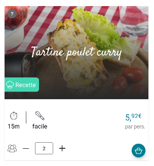
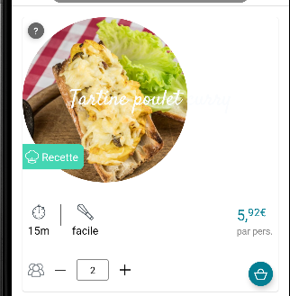
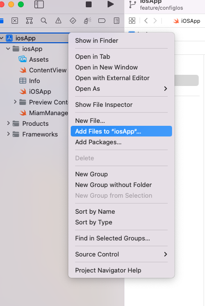
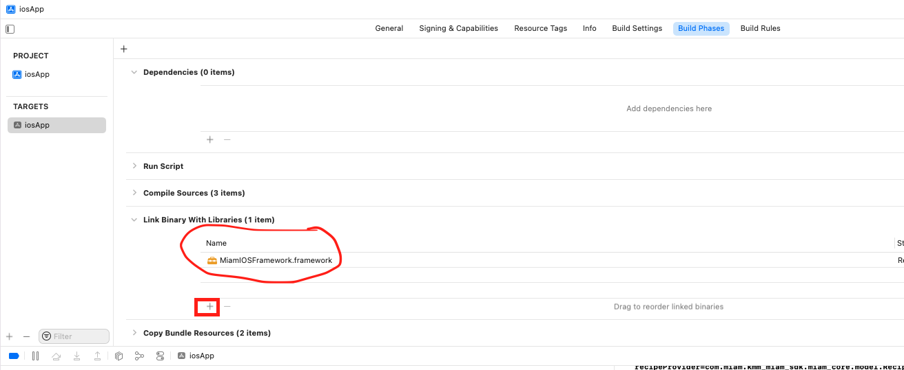
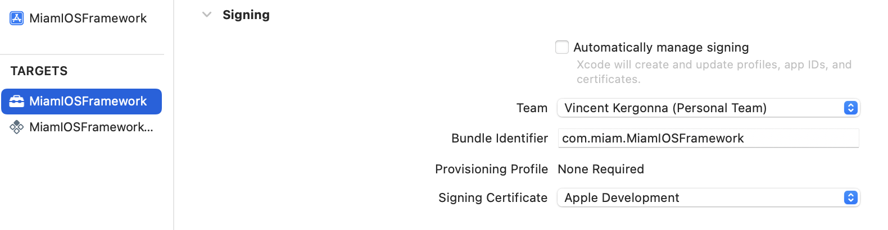
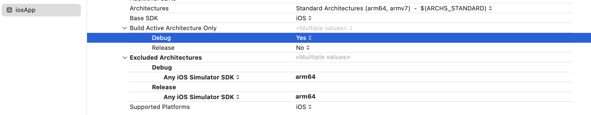
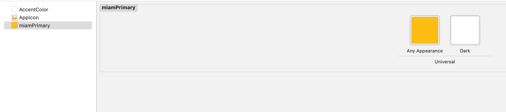

# KMM Miam SDK

[[_TOC_]]

## Introduction

This SDK aims to facilitate the integration of Miam eCommerce to any grocery shopping mobile application.

It implements a series of components that can be re-styled to your standards, and injected into your app. Miam Components interact with each other and take care of the communication with Miam API. Using this SDK, you should not need to communicate with Miam API directly from your app.

### 3 steps integration

The integration of the SDK into your app will take three steps:
1. **Initialization** : define the few mapping functions the SDK needs to interact with your app (push products to basket, retrieve the user unique id...)
2. **Components injection** : fill your app with Miam components wherever relevant (recipe cards in search results grids, recipes catalog on a dedicated page...)
3. **Styling** : apply your own stylesheets, globally at the SDK level, and specifically for each component 

### Project architecture

This SDK is leveraging Kotlin Multiplatform Mobile so most of the Models, Controllers, and Services (interactions with Miam API) can be implemented only once and reused both in iOS and Android apps. Only the Views have to be implemented separately for each platform.

Consequently, this SDK is organized in three main modules (TODO: naming to be reviewed):
- /shared : contains the core logic shared between the two platforms
- /androidSDK : the SDK to be built and imported in an Android app, containing the core logic + Android-related Views
- /MiamIOSFramework : same thing, but for iOS apps

For instance, in the case of an Android application, you shouldn't have to import the built archive of /shared and /androidSDK : building /androidSDK to an APK and importing it will be enough, as this APK will contain the whole logic (/shared + Android views).

## Android integration (Kotlin)

> Minimum required Kotlin version is `1.6.10`

### Initialization

#### Build and import

CI/CD is not setup yet and the built archived are not hosted anywhere. You will need to clone this repository and build the archive in production mode.

The archive will be generated as `miam-sdk-release.aar` in `/androidSDK/build/outputs`.

Import it into your project, in the `libs` folder.

Finally, import it to your Gradle configuration:

```kotlin
// In the app build.gradle file
implementation(name:'miam-SDK-release', ext:'aar')
```

#### Dependencies

Our components are using [Jetpack Compose](https://developer.android.com/jetpack/compose?gclsrc=aw.ds&gclid=CjwKCAjwrfCRBhAXEiwAnkmKmWkwGezGLmmfauda5_ACVVNtTVPUw576netuScD2mLnGacjr2cB30RoCC24QAvD_BwE) which requires the following third-party libraries:

```kotlin
    implementation("androidx.appcompat:appcompat:1.3.1")
    implementation("androidx.compose.compiler:compiler:1.1.1")
    implementation("androidx.compose.ui:ui:1.1.1")

    // Tooling support (Previews, etc.)
    implementation("androidx.compose.ui:ui-tooling:1.1.1")

    // Foundation (Border, Background, Box, Image, Scroll, shapes, animations, etc.)
    implementation("androidx.compose.foundation:foundation:1.1.1")

    // Material Design
    implementation("androidx.compose.material:material:1.1.1")

    // Material design icons
    implementation("androidx.compose.material:material-icons-core:1.1.1")
    implementation("androidx.compose.material:material-icons-extended:1.1.1")

    // Integration with observables
    implementation("androidx.compose.runtime:runtime-livedata:1.1.1")
    implementation("androidx.compose.runtime:runtime-rxjava2:1.1.1")

    // async image
    implementation("io.coil-kt:coil-compose:1.3.1")
    implementation ("io.coil-kt:coil-svg:1.3.1")

    // dependency injection
    implementation("io.insert-koin:koin-android:3.1.2")
    implementation("io.insert-koin:koin-core:3.1.2")
```

> Jetpack is not mandatory but facilitates the injection of Miam components - See part 2 Components injection

We are using [Ktor]("https://ktor.io/docs/welcome.html") as a Http client, which requires:

```kotlin
    implementation("io.ktor:ktor-client-android:1.6.7")
    implementation("io.ktor:ktor-client-serialization:1.6.7")
    implementation("io.ktor:ktor-client-core:1.6.7")
    implementation("io.ktor:ktor-client-logging:1.6.7")
```


> Caveat: we've noticed potential compatibility issues if you are already using Koin in your own app, if so just add our module in your koin conf

```kotlin
startKoin {
    appDeclaration()
    modules(
        KoinInitializer.miamModuleList
    )
}

```

> Koin must be init before using any miam element

#### Main class

We recommend that all the mapping functions that will define the interactions between the SDK and the host app be wrapped in a main "Miam" class.

This class will use methods and attributes defined in SDK "handler" classes to manage objects such as the User profile, the Basket, or the selected Store. These haldlers are all singletons.

Make sure this main "Miam" class is a singleton and instantiated only once in your runtime. Here is a basic implementation:

```kotlin
import com.miam.kmm_miam_sdk.android.di.KoinInitilizer

class Miam() {

  // Will contain calls to Miam SDK handler classes (User, Basket, Store...)
  init {
    
    // if you have already init koin in your app you don't need this line
    KoinInitilizer.init(context = yourAppContext)
  }

  companion object {
    private var instance: Miam? = null
    fun getInstance(): Miam {
      if (instance != null) return instance!!
      instance = Miam()
      return instance!!
    }
  }
}
```

#### Connection to Miam API

**TODO**

#### User

Miam initialization process will start only after the user is **logged**.

Here is how to pass the user ID to the SDK, directly within the host app:

```kotlin
import com.miam.kmm_miam_sdk.handler.UserHandler

// Reference to your main "Miam" class
Miam.getInstance().UserHandler.updateUserId(USER_ID_IN_HOST_APP (string))
```
Here is how to inform the SDK whenever the user login state changes. We recommend using Observables or EventListeners to that end. For instance : [MutableSharedFlow]("https://kotlin.github.io/kotlinx.coroutines/kotlinx-coroutines-core/kotlinx.coroutines.flow/-mutable-shared-flow/").

```kotlin 
import com.miam.kmm_miam_sdk.handler.UserHandler

class Miam() {
  init {
    // CODE

    OBSERVABLE_ON_USER_OBJECT.collect { user ->
      UserHandler.updateUserId(<string>user.id)
    }
  }

  // CODE
}
```

You can disable Like feature with UserHandler

```kotlin 
import com.miam.kmm_miam_sdk.handler.UserHandler

class Miam() {
  init {
    // CODE
    // false if you don't want like on recipe card
      UserHandler.setEnableLike(false)
  }

  // CODE
}
```

##### Profiling

You can block custom recipe suggestions if the user wishes.

```kotlin 
import com.miam.kmm_miam_sdk.handler.UserHandler

class Miam() {
  init {
    // CODE

    OBSERVABLE_ON_USER_PREF.collect { user ->
      UserHandler.setProfilingAllowed(<boolean>user.allowProfiling)
    }
  }

  // CODE
}

```


#### Store

Miam initialization process will start only after the user has **selected a valid store**.

Firstly, ask Miam team for your "supplier id" (unique for all your apps and websites integrations). We will also spoof the origin header of all the requests sent to Miam API.

Then, initialize the PointOfSaleHandler with this information:

```kotlin 
import com.miam.kmm_miam_sdk.handler.PointOfSaleHandler

class Miam() {
  init {
    //  CODE
    PointOfSaleHandler.setSupplier(<string>YOUR_SUPPLIER_ID)
    PointOfSaleHandler.setSupplierOrigin(<string>YOUR_SUPPLIER_ORIGIN)
  }

  //  CODE
}
```

> Make sure to specify a different origin between your development and production environments

Finally, send the store ID to the SDK (in the example, from the host app):
```kotlin
Miam.getInstance().PointOfSaleHandler.updateStoreId(<string>STORE_ID_IN_HOST_APP)
```

It is possible to define a store as "active" or "inactive". When a store is inactive, Miam initialization process won't start even if the store is selected by the user. 

```kotlin
import com.miam.kmm_miam_sdk.handler.PointOfSaleHandler

// List of store ids in the host app referential
private const val availableStoreIdLists = listof("454", "652")

private fun isActiveOnStore(): Boolean {
  return availableStoreIdLists.contains(<string>STORE_ID_IN_HOST_APP)   
}

Miam.getInstance().PointOfSaleHandler.isAvailable = ::isActiveOnStore
```

#### Basket synchronization

Last but not least, the SDK embeds a complex synchronization system that will ensure Miam always keeps the knowledge of what products have been pushed to or removed from the in-app basket. This mechanism is **mandatory** to ensure products added via Miam recipes are kept consistent with the interactions users will have with the basket outside of Miam components.

> If at some point, you feel like products magically disappear from Miam recipes, or are not removed from the app basket while they should be, this is probably related to this part.

By convenience, we recommend to define a mapping function that transforms the host app YourProduct objects to "Miam products" objects (named `RetailerProduct` in the SDK). The opposite function can also be defined:

```kotlin
import com.miam.kmm_miam_sdk.miam_core.model.RetailerProduct

// Defined in the SDK
data class RetailerProduct(val retailerId :String, val quantity: Int, val name: String?)

private fun yourProductsToRetailerProducts(products: List<YourProduct>): List<RetailerProduct> {
  return YourProduct.map { yourP ->
    RetailerProduct(
      yourP.id,
      yourP.quantity,
      yourP.name
    )
  }
}

private fun retailerProductsToYourProducts(products: List<RetailerProduct>): List<YourProduct> {
  return RetailerProduct.map { product ->
    YourProduct(
      product.id,
      product.quantity,
      product.name
    )
  }
}     
```

Miam needs to listen to any change applied to the basket in the host app. To that end, you have to pass a function to `BasketHandler` with the flowing signature: 
`(callback : (products: List<RetailerProduct>) -> Unit) -> Unit`

```kotlin
import com.miam.kmm_miam_sdk.handler.Basket.BasketHandler

class Miam() {

  // to do after koin initialization, use lateinit var if necessary
  private val basketHandler: BasketHandler = BasketHandlerInstance.instance

  init {
    // give miam a function walled when everything is ready to listen to your basket
    basketHandler.setListenToRetailerBasket(::initBasketListener) 
    // push a first basket to Miam so we can sync your current basket we Miam ones
    // then Miam will call initBasketListener function to listen to any change
    val firstRetailerbasket = yourProductsToRetailerProducts(<List<YourProduct>>basket.productsList)
    basketHandler.pushProductsToMiamBasket(firstRetailerbasket)
    // CODE
  }

  private fun initBasketListener() {
    OBSERVABLE_ON_BASKET_OBJECT.collect { basket ->
      // function will be triggered on every basket change
      val yourBasketAsRetailerproducts = yourProductsToRetailerProducts(<List<YourProduct>>basket.productsList)
      basketHandler.pushProductsToMiamBasket(yourBasketAsRetailerproducts)
    }
  }

  // CODE
}
```

Now, the other way around : everytime Miam's basket changes (every time a recipe is added or removed for example), the added or removed subsequent products have to be pushed to the in-app basket. Another function has to be defined on BasketHandler, with the signature: `(products: List<RetailerProduct>) -> Unit`.

```kotlin
import com.miam.kmm_miam_sdk.handler.Basket.BasketHandler

class Miam() {

  // to do after koin initialization, use lateinit var if necessary
  private val basketHandler: BasketHandler = BasketHandlerInstance.instance

  init {
    basketHandler.setPushProductsToRetailerBasket(::pushProductsToYourBasket)
    // CODE
  }

  private fun pushProductsToYourBasket (products: List<RetailerProduct>) {
    // Convert "Miam products" to your own product objects
    for (product in retailerProductsToYourProducts(products)) { 
      if (it.quantity <= 0) {
        // Removes product from host app basket
        yourDeleteFunction(it)
      } else if (yourTestFunctionAlreadyInBasket(it.id)){
        // Updates quantity of product in host app basket
        yourUpdateFunction(it)
      } else {
        // Add product to host app basket
        yourAddFunction(it)
      }
    }
  }

  // CODE
}   
```

Finally, Miam basket will be confirmed and cleared once the payment has been validated by the user. We have to trigger this event on the BasketHandler as well:

```kotlin
import com.miam.kmm_miam_sdk.handler.Basket.BasketHandler

class Miam() {

  private val basketHandler: BasketHandler = BasketHandler()

  init {
    // CODE

    basketHandler.paymentTotal = fun(): Double { 
      return ORDER_PAID_AMOUNT_IN_APP()
    }
  }

  // CODE
}

// Confirm basket when payment confirmed in app:
Miam.getInstance().basketHandler.handlePayment()
```

#### Miam readiness

You have two ways to check Miam readiness : either call a direct function or listen to Miam event

```kotlin
  val miamContext = ContextHandlerInstance.instance
  // miamContext.isReady() return a bool
  prtinln("is Miam ready ? ${miamContext.isReady()}")

  miamContext.observeReadyEvent().collect { event ->
    val isReady = event == ReadyEvent.isReady
    val isNotReady = event == ReadyEvent.isNotReady
    // Do stuff
  }

```
#### Miam groceries list state

Some Miam internal informations are available for reading only
they can be accesed with `GroceriesListHandler`

```kotlin
    import com.miam.kmm_miam_sdk.handler.GroceriesListHandler

    private var recipeCount = 0

    launch {
        GroceriesListHandler.getRecipeCountChangeFlow().collect {
            recipeCount = it.newRecipeCount
            println("recipes count by flow : $recipeCount " )
        }
    }
    GroceriesListHandler.onRecipeCountChange {
        recipeCount = it
        println("recipes count by callback : $recipeCount " )
    }

```
You can reset Miam recipe list :

```kotlin
  GroceriesListHandler.resetGroceriesList()
```

### Components injection

There are two ways to inject Miam components into the host app:
- with **Jetpack Compose** (preferred as nothing has to be changed on the component itself, except styling adjustments)
- by injecting **your own full XML** version of the component (a bit more complex, but lets you the full flexibility of changing every aspects of the component)

#### With Jetpack Compose (preferred)

For the sake of the example, we will inject a component showing a recipe card in the host app.

Initialize a RecipeView object, passing your current context:

```kotlin
val recipe = RecipeView(this@MainActivity)
```

In Miam, recipe cards can either be "fixed" (= fetched by on a predefined ID) or "suggested" (= fetched based on the user navigation context)

```kotlin
import com.miam.kmm_miam_sdk.miam_core.model.SuggestionsCriteria

// Implemented in Miam SDK
data class SuggestionsCriteria(
  // Ids of products displayed in the search results, right before and after the recipe card
  val shelfIngredientsIds: List<String>? = null,
  // Ids of products displayed on a product details page (optional)
  val currentIngredientsIds: List<String>? = null,
  // Ids of products already in app basket (optional)
  val basketIngredientsIds: List<String>? = null,
  // (optional)
  val groupId: String? = null
)

val recipe1 = RecipeView(this@MainActivity)
val recipe2 = RecipeView(this@MainActivity)

// Instanciate a fixed recipe card
recipe1.bind(recipeId = 305)

// Instanciate a suggested recipe card
recipe2.bind(
  criteria = SuggestionsCriteria(
    shelfIngredientsIds = listOf(
      PRODUCT_ID_IN_APP,
      PRODUCT_ID_IN_APP     
    )
  )
)

// Inject in the page using Compose
setContent {
  Column {
    recipe1.Content()
    recipe2.Content()
  }
}
```

> All injectable components definitions can be found in the /androidSDK folder => have a look at each View file to discover which attributes must be passed to instantiate the view. 

#### With XML injection

If you are not using Jetpack Compose, you can inject Miam recipe cards directly into your own XML View:

```xml
<!-- defined in layout/item_miam.xml -->
<com.miam.kmm_miam_sdk.android.ui.components.recipeCard.RecipeView
    xmlns:android="http://schemas.android.com/apk/res/android"
    xmlns:app="http://schemas.android.com/apk/res-auto"
    android:layout_width="match_parent"
    android:layout_height="wrap_content"/>
```

And then bind the properties like this: 

```kotlin
import com.miam.kmm_miam_sdk.miam_core.model.SuggestionsCriteria

// Implemented in Miam SDK
data class SuggestionsCriteria(
  // Ids of products displayed in the search results, right before and after the recipe card
  val shelfIngredientsIds: List<String>? = null,
  // Ids of products displayed on a product details page (optional)
  val currentIngredientsIds: List<String>? = null,
  // Ids of products already in app basket (optional)
  val basketIngredientsIds: List<String>? = null,
  // (optional)
  val groupId: String? = null
)

val miamCard = R.layout.item_miam as RecipeView

miamCard.bind(criteria = SuggestionsCriteria(
  shelfIngredientsIds = listOf(
    PRODUCT_ID_IN_APP,
    PRODUCT_ID_IN_APP     
  )
))
```

> Can also be done by replacing `R.layout.item_miam` by the usual `findViewById`...

### Styling

This SDK lets you adjust the components styling so they can be naturally inserted in your app without confusing the end user. 

Components styling can be customized by either:
- Passing a whole template and mapping it to the controller inputs/outputs 
- Overriding the style properties

> A combination of both ways can be used. Note that in this case, the default style variables won't be taken into account


#### Overriding style properties

There are two level of customization:  
- Globally: styles defined here will be applied to all components
- Per component: styles defined here will be applied to a specific component only

**Note**:
- Component styling overrides global styling
- Properties that aren't overriden neither globally nor per component will keep their default values defined by Miam in the SDK

> Components injected using Jetpack or XML can both have their styling customized the same way

##### Colors

> Global variables only!!

Here is how to override a color variable globally:

```kotlin
import com.miam.kmm_miam_sdk.android.theme.Colors

// Colors object is defined in SDK
Colors.primary = Color(0xFF44D6B3)
``` 

> Hint: `0x` means hexa , `FF` stands for opacity , `44D6B3` is the color code

List of colors you can override:

| Name |  Default value | Use (TODO) |
|:-------------|:-------------:|:-------------:|
| primary | `#037E92` | 
| secondary | `#209B8F` | 
| ternary | `#E61845` | 
| success | `#44D6B3` | 
| info | `#44D6B3` | 
| warning | `#FFDAA3` | 
| danger | `#F47F7A` | 
| grey | `#676767` | 
| white | `#FAFCFE` | 
| unpureWhite | `#FEFEFE` | 
| black | `#252525` |

##### Wording

All wordings are injected using Miam `Text` objects, which can be overriden globally or component by component as follows:

```kotlin
import com.miam.kmm_miam_sdk.android.ressource.Text

Text.alreadyInCart = "ajoutée"
```

The full list of customizable wordings can be found in file: `androidSDK/src/main/ressource/text.kt`

##### Typography

All font use across SDK are defined here they can be override globaly in `androidSDK/src/main/theme/typography.kt` or in lower level
Our typography are of type [TextStyle]("https://www.jetpackcompose.net/textstyle-in-jetpack-compose")


```kotlin
import com.miam.kmm_miam_sdk.android.theme.Typography

typography.h1 = TextStyle(
        color = Color.Red,
        fontSize = 16.sp,
        fontFamily = FontFamily.Monospace,
        fontWeight = FontWeight.W800,
        fontStyle = FontStyle.Italic,
        letterSpacing = 0.5.em,
        background = Color.LightGray,
        textDecoration = TextDecoration.Underline
    )
```

##### Icons / Images

All icons and images are injected using Miam `Image` objects, which can be overriden globally or component by component as follows:

```kotlin
import com.miam.kmm_miam_sdk.android.ressource.Image

Image.basketIcon = R.drawable.your_basket_icon
```

##### Dimensions

All padding, width or height are injected using Miam `Dimension` object, which can be overriden globally or component by component as follows:

```kotlin
import com.miam.kmm_miam_sdk.android.theme.Dimension

Dimension.xlPadding = 40.dp
```

##### Component-specific properties (example: customize the RecipeCard component)

Everytime a component has customizable properties, its folder will contain a `componentStyle.kt` file describing these properties. eg: `recipeCardStyle.kt`.

You can override property by changing its value:

```kotlin
RecipeCardText.alreadyInCart = "ok c'est dedans"
```

Here is an example to customize the time icon on the RecipeCard component:

```kotlin
RecipeCardImage.time = R.drawable.your_time_icon
```

We recommend using [Modifier]("https://developer.android.com/reference/kotlin/androidx/compose/ui/Modifier") to override other styles. The full list is available in `ComponentNameStyle.kt`.

Example:

```kotlin
// You can set those option in Miam class 
RecipeCardStyle.image = Modifier.height(245.dp).width(245.dp).clip(shape = CircleShape)
```

| *before* | *after* | 
|:-------------|:-------------:|
| | |

#### Customize using a template

All components avalaible for template customization can be found in `theme/template.kt`

```kotlin
  // def of your new template
  private val recipeFunctionTemplateVariable: @Composable (recipe: Recipe, vmRecipe: RecipeViewModel, look : () -> Unit, buy: () -> Unit) -> Unit =
        { recipe: Recipe, vmRecipe: RecipeViewModel,look : () -> Unit, buy: () -> Unit ->
            Column() {
                Clickable(
                    onClick = {look()},
                    children = {
                        Image(
                            painter = rememberImagePainter(recipe.attributes!!.mediaUrl),
                            contentDescription = null,
                            contentScale = ContentScale.Crop,
                            modifier = Modifier
                                .height(150.dp)
                                .clip(RoundedCornerShape(10.dp))
                        )
                    }
                )
                Row(Modifier.fillMaxWidth(), horizontalArrangement = Arrangement.SpaceEvenly) {
                    Icon(
                        tint = Color.Gray,
                        imageVector = Icons.Default.Schedule,
                        contentDescription = "time"
                    )
                    Text(text = recipe.totalTime)
                    Icon(
                        tint = Color.Gray,
                        imageVector = Icons.Default.Person,
                        contentDescription = "person"
                    )
                    Text(text = recipe.attributes!!.numberOfGuests.toString())
                    Icon(
                        tint = Color.Gray,
                        imageVector = Icons.Default.School,
                        contentDescription = "hat"
                    )
                    Text(text ="Difficulté  ${recipe.difficultyLabel}")
                }
                Row(Modifier.fillMaxWidth(), horizontalArrangement = Arrangement.Center){
                    Text(text = recipe.attributes!!.title, fontSize = 20.sp, fontWeight = FontWeight.Bold)
                }


            }
        }
    

    // Then You just need to pass this `var` into our template holder
    Template.recipeCardTemplate = recipeFunctionTemplateVariable

```

> As Compose doesn't support yet passing reference of a `@Compose` function we have to pass it through a variable


### Planned improvements

#### Architecture readability

- Reduce use of `Flow` pattern accross SDK
- Review naming of mapping functions
- Simplify mapping functions to be defined in host apps

#### Deployment and hosting

- CI/CD using Gitlab
- Expose archives in hosted dependency management services 

#### More components styling

Component available for low level customization :

| Name | Style | Color | Icon | Text | Preview | Template |
|:-------------|:-------------:|:-------------:|:-------------:|:-------------:|:-------------:|:-------------:|
| Recipe card |✅ | ❌ | ✅ |✅ | ❌ | ✅
| Basket preview |✅ | ✅ |✅ | ✅ | ❌| ✅
| Price |  ✅ |  ✅ |➖| ✅ | ✅| ❌
| Item selector |✅ | ✅ |✅ |✅ | ❌| ✅
| Recipe detail |✅| ✅ |✅|✅| ❌| ✅
| Counter | ✅| ✅ |✅|➖ |✅| ❌
| Dialog |✅ | ➖|➖|➖ | ➖| ➖

- Add component preview for development

#### SDK: performance

- Improve build
- Improve fetches and add cache

#### SDK: new components

- Recipes catalog
- Selected recipes history page
- Favorites recipes
- Personal recipes creation
- Recipe tags

## iOS integration (Swift)

### Initialization

#### Build and import

CI/CD is not setup yet and the built archives are not hosted anywhere. You will need to clone this repository and build the archive in production mode.

run `./gradlew assembleXCFramework`

Then go in your project click on your app name with two fingers, add select `add file to`


Navigate to miam kmm repo and select `MiamIOSFramework.xcodeproj`


You can now select your project and select **Build Phases** tab open "Link Binaries With Libraries" expander.
then click on **+** button and select your framwork



#### Running the demo application on your device

To run the demo application on a real device, you will need to update the signing certificates. 

* for iOSApp certificates can be managed by Xcode (Automatically manage signing), just select your team name in the list.

* for MiamIOSFramework and MiamIOSFrameworkTests signing has to be set to manual. Select your team and make sure to use the same team as for iOSApp. Then select your signing certificate.



#### Running the demo application in the simulator on Apple Silicon (M1, M2)

To run miam iOS Framework on Apple Silicon, a few steps are required:

1. Xcode need to be opened using Rosetta


2. arm64 architecture must be excluded the build when building for iOS Simulator.




#### Main class

We recommend that all the mapping functions that will define the interactions between the SDK and the host app be wrapped in a main "Miam" class.

This class will use methods and attributes defined in SDK "handler" classes to manage objects such as the User profile, the Basket, or the selected Store. These haldlers are all singletons.

Make sure this main "Miam" class is a singleton and instantiated only once in your runtime. Here is a basic implementation

```swift
// file Miam.swift
import Foundation
import shared

public class Miam {
  public static let sharedInstance = Miam()
    
 // need to be private
  private init() {
      KoinKt.doInitKoin() 
  }
}
```

```swift
//IosApp.swift

import SwiftUI

@main
struct ios_miam_integrationApp: App {
    @UIApplicationDelegateAdaptor(AppDelegate.self) var appDelegate
    var body: some Scene {
        WindowGroup {
            ContentView()
        }
    }
}

class AppDelegate: NSObject, UIApplicationDelegate {
    func application(_ application: UIApplication, didFinishLaunchingWithOptions launchOptions: [UIApplication.LaunchOptionsKey: Any]?) -> Bool {
        // init miam
        let _ = Miam.sharedInstance
        return true
    }
}
```
#### Miam readiness

As soon as miam is available `isReady` will return `true`


```swift
   LogHandler.companion.info("Are you ready ? \(ContextHandlerInstance.shared.instance.isReady())")
     ContextHandlerInstance.shared.instance.onReadyEvent(callback: {
       // do your call back here
     })
    
    // Do stuff
  
```

#### Miam groceries list state

Some Miam internal informations are available for reading only
they can be accesed with `GroceriesListHandler`

You can get or subscribe to our recipe count :

```swift
struct ContentView: View {
    
    @State private var recipeCount: Int = 0

    var body: some View {
      VStack {
        Text("Recette dans le panier : \(recipeCount)")
      }.onAppear(
            perform: {  
              GroceriesListHandler.shared.onRecipeCountChange(
                  updateRecipeCount: {count in recipeCount = Int(count) }
              )
            }
          )
    }

}
```

You can reset Miam recipe list :

```swift
 Button("reset recipe list", action: { GroceriesListHandler.shared.resetGroceriesList()})
```

#### Connection to Miam API

**Comming soon**

#### User
Miam initialization process will start only after the user is **logged**.

Here is how to pass the user ID to the SDK, directly within the host app:

```swift
// From anywhere
import shared

// USER_ID_IN_HOST_APP is your user id type String is expected
UserHandler.shared.updateUserId(userId: USER_ID_IN_HOST_APP)
```

> ⚠️ before using UserHandler, make sure Koin is initialized

Here is how to inform the SDK whenever the user login state changes. We recommend using Observables or EventListeners to that end.

```swift
// file Miam.swift
import shared

public class Miam {
  // CODE

  private init() {
    // CODE

    OBSERVABLE_ON_USER_OBJECT.sink { _  in
      // USER_ID_IN_HOST_APP is your user id type String is expected
      UserHandler.shared.updateUserId(userId: USER_ID_IN_HOST_APP)
    }
  }

  // CODE
}
```

You can disable like feature on recipe using UserHandler

```swift
// file Miam.swift
import shared

public class Miam {
  // CODE

  private init() {
    // CODE
      UserHandler.shared.setEnableLike(isEnable: false)
  }

  // CODE
}
```

##### Profiling

You can block custom recipe suggestions if the user wishes.

```swift
import shared

public class Miam {
  // CODE

  private init() {
    // CODE

    OBSERVABLE_ON_USER_PREF.sink { _  in
      // allowance is a boolean, true by default
      UserHandler.shared.setProfilingAllowed(allowance: USER_PREF_IN_HOST_APP)
    }
  }

  // CODE
}

```

#### Store

Miam initialization process will start only after the user has **selected a valid store**.

Firstly, ask Miam team for your "supplier id" (unique for all your apps and websites integrations). We will also spoof the origin header of all the requests sent to Miam API.

Then, initialize the PointOfSaleHandler with this information:

```swift
// file Miam.swift
import shared

class Miam {
  
  private init() {
    //  CODE
      PointOfSaleHandler.shared.setSupplierOrigin(origin : <string>YOUR_SUPPLIER_ORIGIN)
      PointOfSaleHandler.shared.setSupplier(supplierId: <string>YOUR_SUPPLIER_ID)
  }

  //  CODE
}
```

> Make sure to specify a different origin between your development and production environments
Finally, send the store ID to the SDK (in the example, from the host app):

```swift
// From anywhere
import shared

// STORE_ID_IN_HOST_APP is your user id type String is expected
PointOfSaleHandler.updateStoreId(storeId: <string>STORE_ID_IN_HOST_APP)
```
> ⚠️ before using UserHandler, make sure Koin is initialized


It is possible to define a store as "active" or "inactive". When a store is inactive, Miam initialization process won't start even if the store is selected by the user. 

```swift
// file Miam.swift

// List of store ids in the host app referential
private  let availableStoreIdLists = ["454", "652"]

func isActiveOnStore() -> KotlinBoolean {
        return  KotlinBoolean(value: availableStoreIdLists.contains("35290"))
}
    
PointOfSaleHandler.shared.isAvailable = isActiveOnStore
```

#### Basket synchronization

Last but not least, the SDK embeds a complex synchronization system that will ensure Miam always keeps the knowledge of what products have been pushed to or removed from the in-app basket. This mechanism is **mandatory** to ensure products added via Miam recipes are kept consistent with the interactions users will have with the basket outside of Miam components.

> If at some point, you feel like products magically disappear from Miam recipes, or are not removed from the app basket while they should be, this is probably related to this part.

By convenience, we recommend to define a mapping function that transforms the host app YourProduct objects to "Miam products" objects (named `RetailerProduct` in the SDK). The opposite function can also be defined:

```swift
import shared

// Defined in the kotlin SDK, but can be used in swift
// data class RetailerProduct(val retailerId :String, val quantity: Int, val name: String?)

 private func yourProductsToRetailerProducts(products: Array<YourProduct>) -> Array<RetailerProduct> {
      return products.map {
       return RetailerProduct(
            retailerId: $0.id,
            quantity: Int32($0.quantity),
            name: $0.name,
            productIdentifier: nil
        )
      }
    }

private func retailerProductsToYourProducts(products: Array<RetailerProduct>) -> Array<YourProduct> {
  return RetailerProduct.map { 
    return YourProduct(
       id: $0.retailerId,
       name: "\($0.name)",
       quantity: Int($0.quantity)
    )
  }
}     
```

Miam needs to listen to any change applied to the basket in the host app. To that end, you have to pass a function to `BasketHandler` 

```swift

class Miam {

   private let basketHandler: BasketHandler 

  init {
    KoinKt.doInitKoin() 
    basketHandler = BasketHandlerInstance.shared.instance
     // give miam a function walled when everything is ready to listen to your basket
    basketHandler.listenToRetailerBasket(func: initBasketListener) 
    // push a first basket to Miam so we can sync your current basket we Miam ones
    // then Miam will call initBasketListener function to listen to any change
    val firstRetailerbasket = yourProductsToRetailerProducts(basket.productsList)
    basketHandler.pushProductsToMiamBasket(firstRetailerbasket)

    // CODE
  }

  private func initBasketListener() {
    OBSERVABLE_ON_BASKET_OBJECT.sink  { receiveValue in
            // callback will be triggered on every basket change
             basketHandler.pushProductsToMiamBasket(
               yourProductsToRetailerProducts(receiveValue)
               )
       }
  }

  // CODE
}
```

Now, the other way around : everytime Miam's basket changes (every time a recipe is added or removed for example), the added or removed subsequent products have to be pushed to the in-app basket. Another function has to be defined on BasketHandler, with the signature: ` ([RetailerProduct]) -> Void`.

```swift
// file Miam.swift
import shared

class Miam {
   // CODE
  private let basketHandler: BasketHandler

  private init() {
    KoinKt.doInitKoin() 
    basketHandler = BasketHandlerInstance.shared.instance
    basketHandler.pushProductsToRetailerBasket(func: pushProductsToYourBasket)
    // CODE
  }

  private func pushProductsToYourBasket (products: [RetailerProduct]) {
    // Convert "Miam products" to your own product objects
    retailerProductsToYourProducts(products).foreach( { 
      if ($0.quantity <= 0) {
        // Removes product from host app basket
        yourDeleteFunction($0)
      } else if (yourTestFunctionAlreadyInBasket($0.id)){
        // Updates quantity of product in host app basket
        yourUpdateFunction($0)
      } else {
        // Add product to host app basket
        yourAddFunction($0)
      }
    })
  }

  // CODE
}   
```

Finally, Miam basket will be confirmed and cleared once the payment has been validated by the user. We have to trigger this event on the BasketHandler as well:

```kotlin

class Miam() {

  private let basketHandler: BasketHandler = BasketHandler()

  private init() {
    // CODE
    basketHandler.paymentTotal = getTotalPayment
  }

  private func getTotalPayment() -> KotlinDouble {
      return ORDER_PAID_AMOUNT_IN_APP()
  }

  // CODE
}

// Confirm basket when payment confirmed in app:
Miam.getInstance().basketHandler.handlePayment()
```
### Components injection

There are two ways to inject Miam components into the host app:
- with **SwiftUi** (preferred as nothing has to be changed on the component itself, except styling adjustments)
- Or with **UIKit**

#### With SwiftUi (preferred)

For the sake of the example, we will inject a component showing a recipe card in the host app.
In Miam, recipe cards can either be "fixed" (= fetched by on a predefined ID) or "suggested" (= fetched based on the user navigation context)


```swift
// ContentView.swift

// Implemented in Shared can be use directly
data class SuggestionsCriteria(
  // Ids of products displayed in the search results, right before and after the recipe card
  val shelfIngredientsIds: List<String>? = null,
  // Ids of products displayed on a product details page (optional)
  val currentIngredientsIds: List<String>? = null,
  // Ids of products already in app basket (optional)
  val basketIngredientsIds: List<String>? = null,
  // (optional)
  val groupId: String? = null
)

 var criteria = SuggestionsCriteria(
        shelfIngredientsIds: ["5319173","970417"],
            currentIngredientsIds:nil,
            basketIngredientsIds: nil,
            groupId: nil
        
    )

 var body: some View {
      VStack {
          // Direct recipe load
          RecipeCardView(recipeId: "1")
          // load recipe with criteria
          RecipeCardView(criteria: criteria)
      }
```

#### With UIKit 

You can inject our compomemt in a Uikit App 

```swift

if #available(iOS 14.0, *) {
  let swiftUIView = SomeSwiftUIView() // swiftUIView is View
  let viewCtrl = UIHostingController(rootView: swiftUIView)
}

```

you can find more info [here]("https://developer.apple.com/forums/thread/652405")

### Styling

### Colors

Colors can be globally overriden by redefining them in your main assets file. 



Below is a table of color names and default values. 


| Name |  Default value |
|:-------------|:-------------:|
|miamBlack|#252525|
|miamBlack20|#202020|
|miamBorder|#DDDDDD|
|miamBorderLight|#E9E9E9|
|miamDanger|#F47F7A|
|miamGrey|#676767|
|miamGreySurface|#EDEDED|
|miamInfo|#44D6B3|
|miamLightGrey|#9F9F9F|
|miamMusterd|#FFC700|
|miamNeutralGrey|#575756|
|miamPrimary|#037E92|
|miamPrimaryDark|#005562|
|miamPrimaryLight|#BED5DC|
|miamPrimaryLighter|#F3F9FA|
|miamPrimaryText|#007E92|
|miamSecondary|#E61845|
|miamSecondaryText|#4B555D|
|miamSuccess|#44D6B3|
|miamTernary|#209B8F|
|miamUnpureWhite|#FEFEFE|
|miamWarning|#FFDAA3|
|miamWhite|#FAFCFE|

#### 

### Template injection

You can provide your own swiftUi template and map it with our controller 

All cutomizable elements are availables in `theme/Template.swift`

```swift

Template.sharedInstance.counterTemplate =
        {(count: Int,
          increase: @escaping () -> Void,
          decrease: @escaping () -> Void ) -> AnyView in
            AnyView(
               HStack{
                   Button(action: {
                       decrease()
                   }) {
                       Image(systemName: "minus.circle.fill").foregroundColor(.red)
                   }
                   Text(String(count))
                   Button(action: {
                       increase()
                   }) {
                       Image(systemName: "plus.circle").foregroundColor(.blue)
                   }
                }
          )}
```