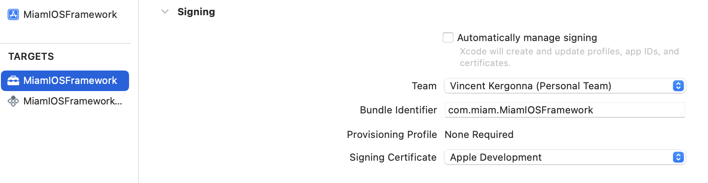
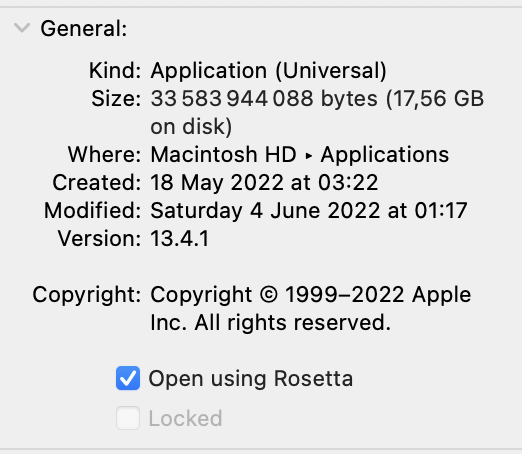

## Run on your device

To run the demo application on a real device, you will need to update the signing certificates.

:::tip
for iOSApp certificates can be managed by Xcode (Automatically manage signing), just select your
team name in the list.
:::

for MiamIOSFramework and MiamIOSFrameworkTests signing has to be set to manual. Select your team
and make sure to use the same team as for iOSApp. Then select your signing certificate.

## On Apple Silicon (M1, M2)
To run miam iOS Framework on Apple Silicon, a few steps are required:

Xcode need to be opened using Rosetta

:::info
arm64 architecture must be excluded the build when building for iOS Simulator.
:::