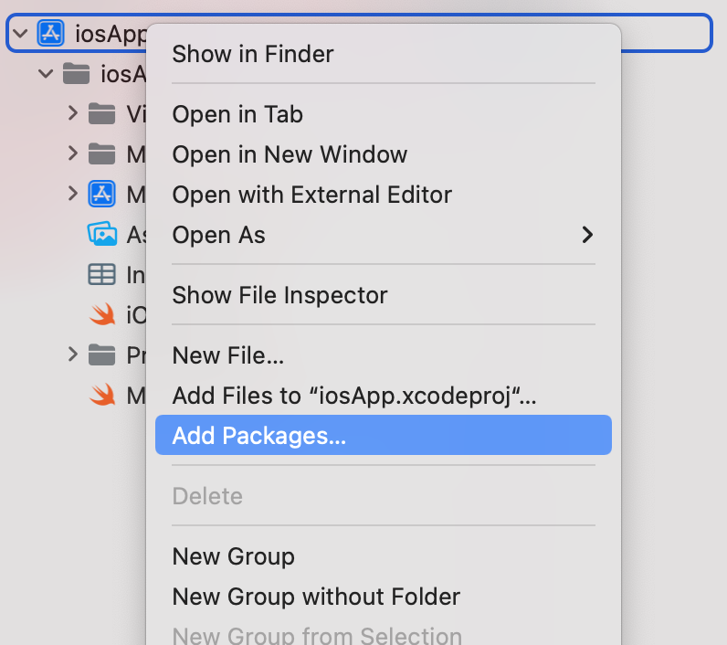
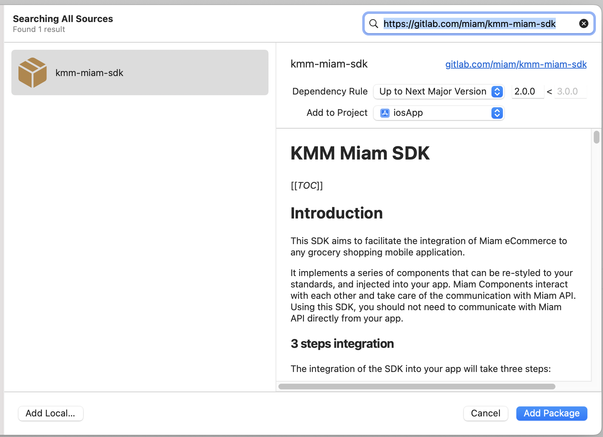
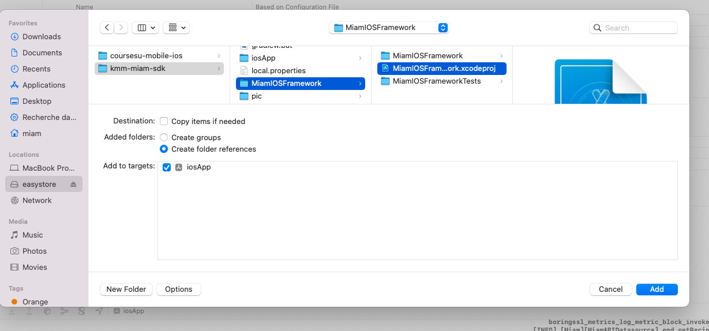
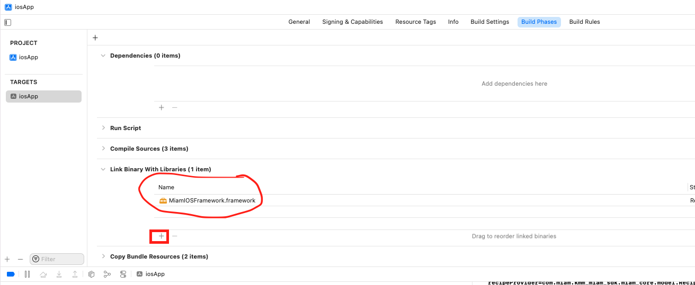

# Installation

You can use Miam with Maven. Just add the following tags to your build dependencies

## Cocoapods

To integrate MiamIOSFramework into your Xcode project using CocoaPods, specify it in your Podfile:

```
pod 'MiamIOSFramework'
```

## Swift package manager installation

To add MiamIOSFramework as a dependency directly from Xcode.




## Manual Installation


You will need to clone this repository and build the archive in production mode, you need for it to install AndroidStudio and get gradle dependencies
then run :

```
run ./gradlew assembleXCFramework
```

Then go in your project click on your app name with two fingers, add select add file to


Navigate to miam kmm repo and select `MiamIOSFramework.xcodeproj`



You can now select your project and select Build Phases tab open "Link Binaries With Libraries"
expander. then click on + button and select your framwork



