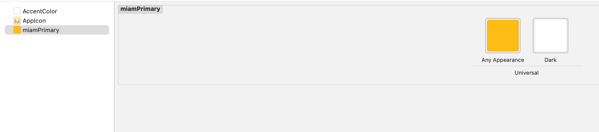
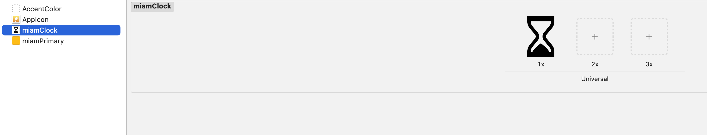

# Styling


## Overriding style properties

You can globally customize styles by overiding some classes it will be applied to all components.
There severale type of properi that can be override **Colors**, **Wording**, **Typography**, **Icons / Images** and **Dimentions**


### Colors

Colors can be globally overriden by redefining them in your main assets file.



<details>
  <summary>Exhaustive color list and default values 👇</summary>
  <div>
    <div>
    <table>
   <tr>
        <th> Name </th>
        <th>Default value</th>
    </tr>
    <tr>
        <td>miamBlack</td>
        <td>#252525</td>
    </tr>
     <tr>
        <td>miamBlack20</td>
        <td>#202020</td>
    </tr>
     <tr>
        <td>miamBorder</td>
        <td>#DDDDDD</td>
    </tr>
     <tr>
        <td>miamBorderLight</td>
        <td>#E9E9E9</td>
    </tr>
     <tr>
        <td>miamDanger</td>
        <td>#F47F7A</td>
    </tr>
     <tr>
        <td>miamGrey</td>
        <td>#676767</td>
    </tr>
     <tr>
        <td>miamGreySurface</td>
        <td>#EDEDED</td>
    </tr>
     <tr>
        <td>miamInfo</td>
        <td>#44D6B3</td>
    </tr>
     <tr>
        <td>miamLightGrey</td>
        <td>#9F9F9F</td>
    </tr>
     <tr>
        <td>miamMusterd</td>
        <td>#FFC700</td>
    </tr>
      <tr>
        <td>miamNeutralGrey</td>
        <td>#575756</td>
    </tr>
      <tr>
        <td>miamPrimary</td>
        <td>#037E92</td>
    </tr>
      <tr>
        <td>miamPrimaryDark</td>
        <td>#005562</td>
    </tr>
      <tr>
        <td>miamPrimaryLight</td>
        <td>#BED5DC</td>
    </tr>
      <tr>
        <td>miamPrimaryLighter</td>
        <td>#F3F9FA</td>
    </tr>
     <tr>
        <td>miamPrimaryText</td>
        <td>#007E92</td>
    </tr>
     <tr>
        <td>miamSecondary</td>
        <td>#E61845</td>
    </tr>
     <tr>
        <td>miamSecondaryText</td>
        <td>#4B555D</td>
    </tr>
     <tr>
        <td>miamSuccess</td>
        <td>#44D6B3</td>
    </tr>
     <tr>
        <td>miamTernary</td>
        <td>#209B8F</td>
    </tr>
     <tr>
        <td>miamUnpureWhite</td>
        <td>#FEFEFE</td>
    </tr>
     <tr>
        <td>miamWarning</td>
        <td>#FFDAA3</td>
    </tr>
     <tr>
        <td>miamWhite</td>
        <td>#FAFCFE</td>
    </tr>
</table>
    
    </div>
    <br/>
    
  </div>
</details>


### Wording

There is two way to override Text in the SDK

- By assigning a new value to MiamText (**deprecated**)
- By using I18n resolver (**recommended**)

#### Using MiamText

```swift
  MiamText.sharedInstance.alreadyInCart = "ok done"
```


### Icons / Images

Icons can be globally overriden by redefining them in your main assets file.



<details>
  <summary>Exhaustive icon list and default values 👇</summary>
  <div>
    <div>
    <table>
   <tr>
        <th> Name </th>
        <th>Default icon</th>
    </tr>
    
</table>
    
    </div>
    <br/>
    
  </div>
</details>


### Dimensions


## Templating

You can provide your own swiftUi template and map it with our controller
All cutomizable elements are availables in theme/Template.swift

```swift

Template.sharedInstance.counterTemplate =
        {(count: Int,
          increase: @escaping () -> Void,
          decrease: @escaping () -> Void ) -> AnyView in
            AnyView(
               HStack{
                   Button(action: {
                       decrease()
                   }) {
                       Image(systemName: "minus.circle.fill").foregroundColor(.red)
                   }
                   Text(String(count))
                   Button(action: {
                       increase()
                   }) {
                       Image(systemName: "plus.circle").foregroundColor(.blue)
                   }
                }
          )}
```

